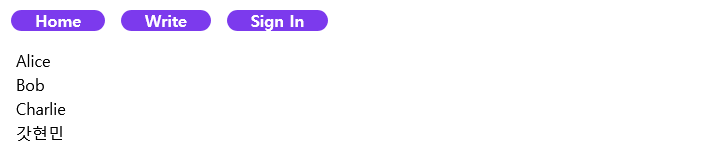
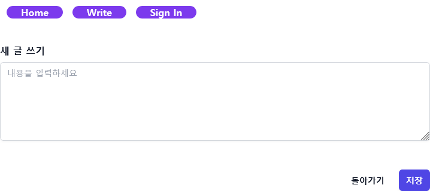
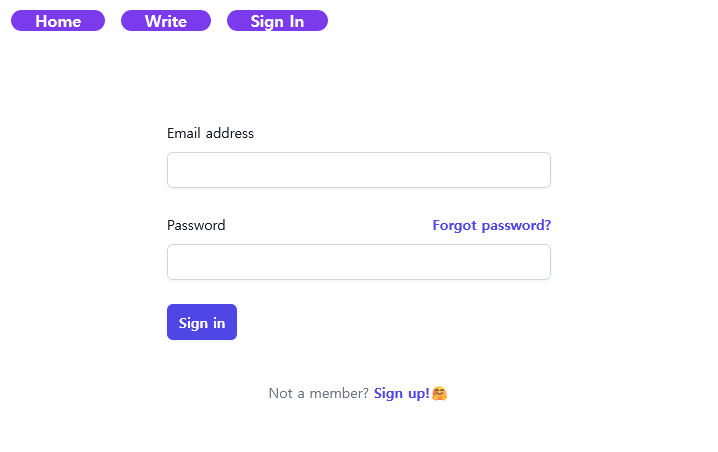

# A tiny website for Week13

## Tools used:

1. SvelteKit
2. Tailwind CSS
3. MySQL

## It will have features like:

### Home

1. [x] A List of posts
2. [] List of comments for each post
   - [] Write comment
   - [] Delete comment
   - [] Expand/Collapse when clicked

### Write

1. [x] Write a new post
   - [] only for authorized users

### Sign In

1. [] Sign up
   - [] Duplicate check
2. [] Sign in
   - [] JWT or OAuth
3. [] Password Recovery
